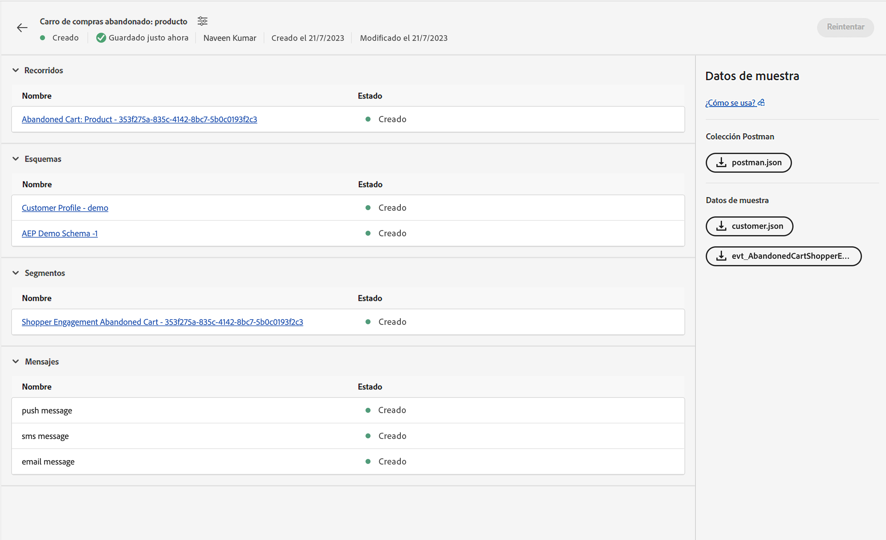
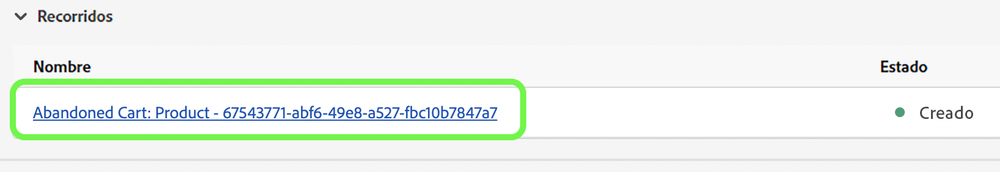
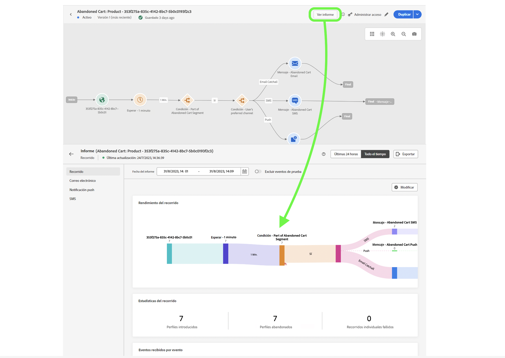

# Evento unitario

## Pasos a seguir {#steps-to-follow}

>[!CONTEXTUALHELP]
>id="marketerexp_sampledata_unitaryevent"
>title="¿Cómo se utiliza?"
>abstract="Para más información, siga el vínculo"

>[!IMPORTANT]
>
>Estas instrucciones pueden cambiar en el **[!UICONTROL Manual de tácticas]**, por lo que le recomendamos que consulte siempre la sección Datos de ejemplo del **[!UICONTROL Manual de tácticas]**.

## Requisito previo

* Debe tener instalado el software de Postman
* Utilice el manual de tácticas para crear recursos de instancia como **[!UICONTROL Recorrido]**, **[!UICONTROL Esquemas]**, **[!UICONTROL Segmentos]**, **[!UICONTROL Mensajes]** etc.

Los recursos creados se mostrarán en la página `Bill Of Material` 



## Preparar Postman con la colección necesaria

1. Visite la aplicación **[!UICONTROL Manual de tácticas de casos de uso]**.
1. Haga clic en la tarjeta correspondiente del **[!UICONTROL Manual de tácticas]** para visitar la página de detalles del **[!UICONTROL Manual de tácticas]**.
1. Visite la página **[!UICONTROL Lista de materiales]** y consulte la sección **[!UICONTROL Datos de muestra]**.
1. Descargue `postman.json` haciendo clic en los botones correspondientes de la interfaz de usuario.
1. Importar `postman.json` en **[!DNL Postman Software]**.
1. Cree un entorno de Postman dedicado para esta validación (por ejemplo, `Adobe <PLAYBOOK_NAME>`).

## Obtener token de IMS

>[!NOTE]
>
>Todas las variables de entorno distinguen entre mayúsculas y minúsculas, así que utilice siempre el nombre exacto de la variable.

1. Siga la documentación en [Autenticar y acceder a las API de Experience Platform](https://experienceleague.adobe.com/docs/experience-platform/landing/platform-apis/api-authentication.html?lang=es) para generar el token de acceso.
1. Almacene el valor de token de acceso en las variables de entorno denominadas `ACCESS_TOKEN`.
1. Almacene otros valores relacionados con la autenticación como `API_KEY`, `IMS_ORG` y `SANDBOX_NAME` en variables de entorno.

>[!IMPORTANT]
>
>Antes de ejecutar cualquier API desde Postman, asegúrese de que todas las variables de entorno requeridas deben ser añadidas.

## Publicar el recorrido creado por el manual de tácticas

Hay 2 formas de publicar el recorrido; puede elegir cualquiera de ellas:

1. **Utilizando la interfaz de usuario de AJO**: haga clic en el vínculo recorrido en `Bill Of Material Page`; esto le redirigirá a la página recorrido allí puede hacer clic en el botón **[!UICONTROL Publicar]** y el recorrido se publicará.

   

1. **Uso de la API de Postman**

   1. Activar la solicitud de **[!DNL Publish Journey]** desde **[!DNL Journey Publish]** > **[!DNL Queue journey publish job]**.
   1. La publicación del recorrido puede tardar algún tiempo, así que para comprobar el estado ejecute la API de estado de publicación Comprobar recorrido, hasta que `response.status` sea `SUCCESS`, asegúrese de esperar 10-15 segundos si la publicación del recorrido tarda tiempo.

   >[!NOTE]
   >
   >Todas las variables de entorno distinguen entre mayúsculas y minúsculas, así que utilice siempre el nombre exacto de la variable.

## Ingerir el perfil del cliente

>[!TIP]
>
>Puede reutilizar la misma dirección de correo electrónico añadiendo `+<variable>` a su correo electrónico. Por ejemplo, `usertest@email.com` puede reutilizarse como `usertest+v1@email.com` o `usertest+24jul@email.com`. Esto sería útil para tener un perfil nuevo cada vez, pero utilizando la misma dirección de correo electrónico.

1. El primer usuario debe crear **[!DNL customer dataset]** y **[!DNL HTTP Streaming Inlet Connection]**.
1. Si ya ha creado las páginas **[!DNL customer dataset]** y **[!DNL HTTP Streaming Inlet Connection]**, vaya directamente al paso `5`.
1. Active **[!DNL Customer Profile Ingestion]** > **[!DNL Create Customer Profile InletId]** > **[!DNL Create Dataset]** para crear **[!DNL customer dataset]**; esto almacenará un `CustomerProfile_dataset_id` en las variables de entorno de postman.
1. Cree **[!DNL HTTP Streaming Inlet Connection]**, utilice las API de Postman bajo **[!DNL Customer Profile Ingestion > Create Customer Profile InletId]**.

   1. `CustomerProfile_dataset_id` debe estar disponible en las variables de entorno de postman; de lo contrario, consulte el paso `3`.
   1. Active **[!DNL `CREATE Base Connection`]** a [!DNL create base connection].
   1. Active **[!DNL `CREATE Source Connection`]** a [!DNL create source connection].
   1. Active **[!DNL `CREATE Target Connection`]** a [!DNL create target connection].
   1. Active **[!DNL `CREATE Dataflow`]** a [!DNL create dataflow].
   1. Active **[!DNL `GET Base Connection`]**- esto almacenará automáticamente `CustomerProfile_inlet_id` en las variables de entorno de postman.

1. En este paso debe tener `CustomerProfile_dataset_id` y `CustomerProfile_inlet_id` en las variables de entorno de postman; de lo contrario, consulte el paso `3` o `4` respectivamente.
1. Para ingerir el cliente, el usuario necesita almacenar `customer_country_code`, `customer_mobile_no`, `customer_first_name`, `customer_last_name` y `email` en las variables de entorno de postman.

   1. `customer_country_code` sería el código de país del número de móvil, por ejemplo `91` o `1`
   1. `customer_mobile_no` sería el número de móvil, por ejemplo `9987654321`
   1. `customer_first_name` sería el nombre del usuario
   1. `customer_last_name` sería el apellido del usuario
   1. `email` sería la dirección de correo electrónico del usuario, esto es crucial para utilizar una identificación de correo electrónico distinta para que se pueda ingerir un perfil nuevo.

1. Actualice la solicitud de Postman **[!DNL Customer Ingestion]** > **[!DNL Customer Streaming Ingestion]** para cambiar el canal preferido del cliente; de forma predeterminada, [!DNL `email`] está configurado en la solicitud.

   ```js
   "consents": {
       "marketing": {
           "preferred": "email",
           "email": {
               "val": "y"
           },
           "push": {
               "val": "n"
           },
           "sms": {
               "val": "n"
           }
       }
   }
   ```

1. Cambie el canal preferido a `sms` o `push` y el valor del canal respectivo a `y` y `n` a otros valores, p. ej.

   ```js
   "consents": {
       "marketing": {
           "preferred": "sms",
           "email": {
               "val": "n"
           },
           "push": {
               "val": "n"
           },
           "sms": {
               "val": "y"
           }
       }
   }
   ```

1. Por último, active **[!DNL `Customer Profile Ingestion > Customer Profile Streaming Ingestion`]** para ingerir el perfil del cliente.

## Ingerir evento

1. La primera vez que el usuario necesita crear **[!DNL event dataset]** y **[!DNL HTTP Streaming Inlet Connection for events]**
1. Si ya ha creado las páginas **[!DNL event dataset]** y **[!DNL HTTP Streaming Inlet Connection for events]**, vaya directamente al paso `5`.
1. Active **[!DNL `Schemas Data Ingestion > AEP Demo Schema Ingestion > Create AEP Demo Schema InletId > Create Dataset`]** para crear **[!DNL event dataset]**, esto almacenará un `AEPDemoSchema_dataset_id` en las variables de entorno de postman
1. Cree **[!DNL HTTP Streaming Inlet Connection for events]**, utilice las API de Postman en **[!DNL Schemas Data Ingestion]** > **[!DNL AEP Demo Schema Ingestion]** > **[!DNL Create AEP Demo Schema InletId]**.

   1. `AEPDemoSchema_dataset_id` debe estar disponible en las variables de entorno de postman; de lo contrario, consulte el paso `3`
   1. Active **[!DNL `CREATE Base Connection`]** a [!DNL create base connection]
   1. Active **[!DNL `CREATE Source Connection`]** a [!DNL create source connection]
   1. Active **[!DNL `CREATE Target Connection`]** a [!DNL create target connection]
   1. Active **[!DNL `CREATE Dataflow`]** a [!DNL create dataflow]
   1. Active **[!DNL `GET Base Connection`]**- esto almacenará automáticamente `AEPDemoSchema_inlet_id` en las variables de entorno de postman

1. En este paso debe tener `AEPDemoSchema_dataset_id` y `AEPDemoSchema_inlet_id` en las variables de entorno de postman; de lo contrario, consulte el paso `3` o `4` respectivamente.
1. Para ingerir el evento, el usuario necesita cambiar la variable de tiempo `timestamp` en el cuerpo de la solicitud de **[!DNL Schemas Data Ingestion]** > **[!DNL AEP Demo Schema Ingestion]** > **[!DNL AEP Demo Schema Streaming Ingestion]** en postman.

   1. `timestamp` para la hora de ocurrencia del evento, utilice la fecha y hora actuales, por ejemplo `2023-07-21T16:37:52+05:30` ajuste la zona horaria según sus necesidades.

1. Active **[!DNL Schemas Data Ingestion > AEP Demo Schema Ingestion > AEP Demo Schema Streaming Ingestion]** para ingerir el evento, de modo que se pueda activar el recorrido

## Validación final

Debe recibir un mensaje en su canal preferido seleccionado utilizado en **[!DNL Ingest the Customer Profile]** paso `8`

* `SMS` si el canal preferido es `sms` en `customer_country_code` y `customer_mobile_no`
* `Email` si el canal preferido es `email` en `email`

También puede consultar `Journey Report`; para comprobarlo haga clic en `Journey Object` en `Bill of Materials page` esto le redirigirá a `Journey Details page`.

Para cualquier recorrido publicado, el usuario debe obtener un botón **[!UICONTROL Ver informe]**



## Limpieza

No tenga varias instancias de `Journey` ejecutándose simultáneamente, detenga el recorrido si es solo para la validación una vez que la validación se ha completado.
