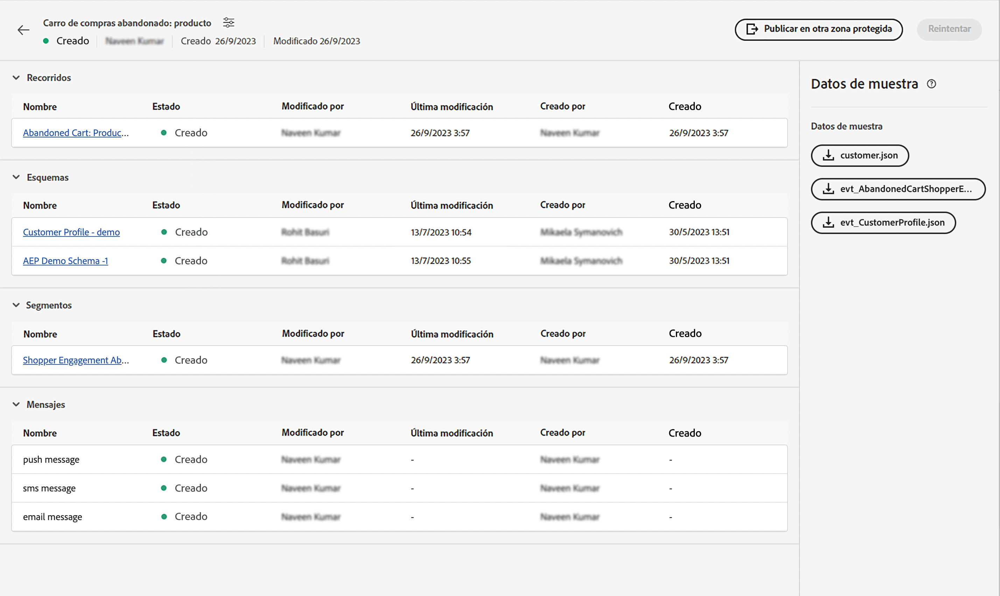

# Evento unitario

## Pasos a seguir {#steps-to-follow}

>[!CONTEXTUALHELP]
>id="marketerexp_sampledata_unitaryevent"
>title="¿Cómo se utiliza?"
>abstract="Para más información, siga el vínculo"

>[!IMPORTANT]
>
>Estas instrucciones pueden cambiar en el **[!UICONTROL Manual de tácticas]**, por lo que le recomendamos que consulte siempre la sección Datos de ejemplo del **[!UICONTROL Manual de tácticas]**.

## Requisito previo

* Utilice el manual de tácticas para crear recursos de instancia como **[!UICONTROL Recorrido]**, **[!UICONTROL Esquemas]**, **[!UICONTROL Segmentos]**, **[!UICONTROL Mensajes]** etc.

* Los recursos creados se mostrarán en la página `Bill Of Material` 

<!-- TODO: attached image needs to change once postman is removed from UI -->


>[!TIP]
>
>Si utiliza un terminal para ejecutar las solicitudes curl, puede definir valores de variables antes de ejecutar las solicitudes curl, de modo que no sea necesario reemplazar esos valores en curls individuales.
>Por ejemplo: si establece `ORG_ID=************@AdobeOrg`, el shell sustituirá automáticamente cada aparición de `$ORG_ID` por el valor, para que pueda copiar, pegar y ejecutar las solicitudes curl siguientes sin ninguna modificación.
>
> En todo este documento se utilizan las siguientes variables
>
> ACCESS_TOKEN
>
> API_KEY
>
> ORG_ID
>
> SANDBOX_NAME
>
> PROFILE_SCHEMA_REF
>
> PROFILE_DATASET_NAME
>
> PROFILE_DATASET_ID
>
> JOURNEY_ID
>
> PROFILE_BASE_CONNECTION_ID
>
> PROFILE_SOURCE_CONNECTION_ID
>
> PROFILE_TARGET_CONNECTION_ID
>
> PROFILE_INLET_URL
>
> CUSTOMER_MOBILE_NUMBER
>
> CUSTOMER_FIRST_NAME
>
> CUSTOMER_LAST_NAME
>
> EMAIL
>
> EVENT_SCHEMA_REF
>
> EVENT_DATASET_NAME
>
> EVENT_DATASET_ID
>
> EVENT_BASE_CONNECTION_ID
>
> EVENT_SOURCE_CONNECTION_ID
>
> EVENT_TARGET_CONNECTION_ID
>
> EVENT_INLET_URL
>
> TIMESTAMP
>
> UNIQUE_EVENT_ID

## Obtener token de IMS

1. Siga la documentación en [Autenticar y acceder a las API de Experience Platform](https://experienceleague.adobe.com/docs/experience-platform/landing/platform-apis/api-authentication.html?lang=es) para generar el token de acceso.

## Publicar el recorrido creado por el manual de tácticas

Hay 2 formas de publicar el recorrido; puede elegir cualquiera de ellas:

1. **Utilizando la interfaz de usuario de AJO**: haga clic en el vínculo recorrido en `Bill Of Material Page`; esto le redirigirá a la página recorrido allí puede hacer clic en el botón **[!UICONTROL Publicar]** y el recorrido se publicará.

   

1. **Uso de cURL**

   1. Publique el recorrido. La respuesta contendrá el ID de trabajo necesario en el siguiente paso para recuperar el estado de publicación del recorrido.

      ```bash
      curl --location --request POST "https://journey-private.adobe.io/authoring/jobs/journeyVersions/$JOURNEY_ID/deploy" \
      --header "Accept: */*" \
      --header "Authorization: Bearer $ACCESS_TOKEN" \
      --header "x-api-key: $API_KEY" \
      --header "x-gw-ims-org-id: $ORG_ID" \
      --header "x-sandbox-name: $SANDBOX_NAME" \
      --header "Content-Type: application/json" 
      ```

   1. La publicación del recorrido puede tardar algún tiempo, así que para comprobar el estado ejecute la solicitud cURL siguiente, hasta que `response.status` sea `SUCCESS`, asegúrese de esperar 10-15 segundos si la publicación del recorrido tarda tiempo.

      ```bash
      curl --location "https://journey-private.adobe.io/authoring/jobs/$JOB_ID" \
      --header "Authorization: Bearer $ACCESS_TOKEN" \
      --header "x-api-key: $API_KEY" \
      --header "x-gw-ims-org-id: $ORG_ID" \
      --header "x-sandbox-name: $SANDBOX_NAME" \
      --header "Content-Type: application/json"
      ```

## Ingerir el perfil del cliente

>[!TIP]
>
>Si su proveedor de correo electrónico admite correos electrónicos Plus, puede reutilizar la misma dirección de correo electrónico añadiendo `+<variable>` a su correo electrónico, p. ej. `usertest@email.com` se puede reutilizar como `usertest+v1@email.com` o `usertest+24jul@email.com`. Esto sería útil para tener un perfil nuevo cada vez, pero utilizando la misma dirección de correo electrónico.
>
>P.D: los correos electrónicos Plus son una función configurable que debe ser compatible con el proveedor de correo electrónico. Compruebe si puede recibir correos electrónicos en dichas direcciones antes de utilizarlas en la prueba.

1. El primer usuario debe crear **[!DNL customer dataset]** y **[!DNL HTTP Streaming Inlet Connection]**.
1. Si ya ha creado las páginas **[!DNL customer dataset]** y **[!DNL HTTP Streaming Inlet Connection]**, vaya directamente al paso `5`.
1. Cree un conjunto de datos de perfil de cliente ejecutando la siguiente solicitud cURL.

   ```bash
   curl --location "https://platform.adobe.io/data/foundation/catalog/dataSet" \
   --header "Authorization: Bearer $ACCESS_TOKEN" \
   --header "x-gw-ims-org-id: $ORG_ID" \
   --header "x-sandbox-name: $SANDBOX_NAME" \
   --header "x-api-key: $API_KEY" \
   --header "Content-Type: application/json" \
   --data '{
       "name": "'$PROFILE_DATASET_NAME'",
       "schemaRef": {
           "id": "'$PROFILE_SCHEMA_REF'",
           "contentType": "application/vnd.adobe.xed-full-notext+json; version=1"
       },
       "tags": {
           "unifiedProfile": [
           "enabled:true"
           ],
           "unifiedIdentity": [
           "enabled:true"
           ]
       },
       "fileDescription": {
           "persisted": true,
           "containerFormat": "parquet",
           "format": "parquet"
       }
   }'
   ```

   La respuesta tendrá el formato `"@/dataSets/<PROFILE_DATASET_ID>"`.

1. Cree **[!DNL HTTP Streaming Inlet Connection]** con la ayuda de los siguientes pasos.
   1. Cree una conexión base.

      ```bash
      curl --location "https://platform.adobe.io/data/foundation/flowservice/connections?Cache-Control=no-cache" \
      --header "Authorization: Bearer $ACCESS_TOKEN" \
      --header "x-gw-ims-org-id: $ORG_ID" \
      --header "x-sandbox-name: $SANDBOX_NAME" \
      --header "x-api-key: $API_KEY" \
      --header "Content-Type: application/json" \
      --data '{
          "name": "AbandonedCartProduct_Base_ConnectionForCustomerProfile_1694458293",
          "description": "Marketer Playground Playbook-Validation Customer Profile Base Connection 1",
          "auth": {
              "specName": "Streaming Connection",
              "params": {
                  "dataType": "xdm"
              }
          },
          "connectionSpec": {
              "id": "bc7b00d6-623a-4dfc-9fdb-f1240aeadaeb",
              "version": "1.0"
          }
      }'
      ```

      Obtenga el ID de conexión base de la respuesta y utilícelo en lugar de `PROFILE_BASE_CONNECTION_ID` en las siguientes solicitudes cURL

   1. Cree una conexión de origen.

      ```bash
      curl --location "https://platform.adobe.io/data/foundation/flowservice/sourceConnections" \
      --header "Authorization: Bearer $ACCESS_TOKEN" \
      --header "x-gw-ims-org-id: $ORG_ID" \
      --header "x-sandbox-name: $SANDBOX_NAME" \
      --header "Content-Type: application/json" \
      --header "x-api-key: $API_KEY" \
      --data '{
          "name": "AbandonedCartProduct_Source_ConnectionForCustomerProfile_1694458318",
          "description": "Marketer Playground Playbook-Validation Customer Profile Source Connection 1",
          "baseConnectionId": "'$PROFILE_BASE_CONNECTION_ID'",
          "connectionSpec": {
              "id": "bc7b00d6-623a-4dfc-9fdb-f1240aeadaeb",
              "version": "1.0"
          }
      }'
      ```

      Obtenga el ID de conexión de origen de la respuesta y utilícelo en lugar de `PROFILE_SOURCE_CONNECTION_ID`

   1. Cree una conexión de destino.

      ```bash
      curl --location "https://platform.adobe.io/data/foundation/flowservice/targetConnections" \
      --header "Authorization: Bearer $ACCESS_TOKEN" \
      --header "x-gw-ims-org-id: $ORG_ID" \
      --header "x-sandbox-name: $SANDBOX_NAME" \
      --header "Content-Type: application/json" \
      --header "x-api-key: $API_KEY" \
      --data '{
          "name": "AbandonedCartProduct_Target_ConnectionForCustomerProfile_1694458407",
          "description": "Marketer Playground Playbook-Validation Customer Profile Target Connection 1",
          "data": {
              "format": "parquet_xdm",
              "schema": {
                  "version": "application/vnd.adobe.xed-full+json;version=1",
                  "id": "'$PROFILE_SCHEMA_REF'"
              },
              "properties": null
          },
          "connectionSpec": {
              "id": "c604ff05-7f1a-43c0-8e18-33bf874cb11c",
              "version": "1.0"
          },
          "params": {
              "dataSetId": "'$PROFILE_DATASET_ID'"
          }
      }'
      ```

      Obtenga el ID de conexión de destino de la respuesta y utilícelo en lugar de `PROFILE_TARGET_CONNECTION_ID`

   1. Cree un flujo de datos.

      ```bash
      curl --location "https://platform.adobe.io/data/foundation/flowservice/flows" \
      --header "Authorization: Bearer $ACCESS_TOKEN" \
      --header "x-gw-ims-org-id: $ORG_ID" \
      --header "x-sandbox-name: $SANDBOX_NAME" \
      --header "Content-Type: application/json" \
      --header "x-api-key: $API_KEY" \
      --data '{
          "name": "AbandonedCartProduct_Dataflow_ForCustomerCustomerProfile_1694460528",
          "description": "Marketer Playground Playbook-Validation Customer Profile Dataflow 1",
          "flowSpec": {
              "id": "d8a6f005-7eaf-4153-983e-e8574508b877",
              "version": "1.0"
          },
          "sourceConnectionIds": [
              "'$PROFILE_SOURCE_CONNECTION_ID'"
          ],
          "targetConnectionIds": [
              "'$PROFILE_TARGET_CONNECTION_ID'"
          ]
      }'
      ```

   1. Obtenga una conexión base. El resultado contendrá inletUrl necesario para enviar datos de perfil.

      ```bash
      curl --location "https://platform.adobe.io/data/foundation/flowservice/connections/$PROFILE_BASE_CONNECTION_ID" \
      --header "Authorization: Bearer $ACCESS_TOKEN" \
      --header "x-gw-ims-org-id: $ORG_ID" \
      --header "x-sandbox-name: $SANDBOX_NAME" \
      --header "Content-Type: application/json" \
      --header "x-api-key: $API_KEY"
      ```

      Obtenga inletUrl de la respuesta y utilícelo en lugar de `PROFILE_INLET_URL`

1. En este paso el usuario debe tener valores de `PROFILE_DATASET_ID` y `PROFILE_INLET_URL`; si no es así, consulte el paso `3` o `4` respectivamente.
1. Para ingerir un cliente, el usuario debe reemplazar `CUSTOMER_MOBILE_NUMBER`, `CUSTOMER_FIRST_NAME`, `CUSTOMER_LAST_NAME` y `EMAIL` en, las solicitudes cURLs siguientes.

   1. `CUSTOMER_MOBILE_NUMBER` sería el número de móvil, por ejemplo `+1 000-000-0000`
   1. `CUSTOMER_FIRST_NAME` sería el nombre del usuario
   1. `CUSTOMER_LAST_NAME` sería el apellido del usuario
   1. `EMAIL` sería la dirección de correo electrónico del usuario, esto es crucial para utilizar una identificación de correo electrónico distinta para que se pueda ingerir un perfil nuevo.

1. Finalmente, ejecute el curl para introducir el perfil del cliente. Actualice `body.xdmEntity.consents.marketing.preferred` hasta `email`, `sms` o `push` en función de los canales que pretenda verificar. Establezca también las opciones correspondientes `val` hasta `y`.

   ```bash
   curl --location "$PROFILE_INLET_URL?synchronousValidation=true" \
   --header 'Content-Type: application/json' \
   --data-raw '{
       "header": {
           "schemaRef": {
               "id": "'$PROFILE_SCHEMA_REF'",
               "contentType": "application/vnd.adobe.xed-full+json;version=1.0"
           },
           "imsOrgId": "'$ORG_ID'",
           "datasetId": "'$PROFILE_DATASET_ID'",
           "source": {
               "name": "Streaming dataflow - 1694460605"
           }
       },
       "body": {
           "xdmMeta": {
               "schemaRef": {
                   "id": "'$PROFILE_SCHEMA_REF'",
                   "contentType": "application/vnd.adobe.xed-full+json;version=1.0"
               }
           },
           "xdmEntity": {
           "consents": {
               "marketing": {
                   "preferred": "email",
                   "email": {
                       "val": "y"
                   },
                   "push": {
                       "val": "n"
                   },
                   "sms": {
                       "val": "n"
                   }
               }
           },
           "mobilePhone": {
               "number": "'$CUSTOMER_MOBILE_NUMBER'",
               "status": "active"
           },
           "person": {
               "name": {
               "firstName": "'$CUSTOMER_FIRST_NAME'",
               "lastName": "'$CUSTOMER_LAST_NAME'"
               }
           },
           "personalEmail": {
               "address": "'$EMAIL'"
           },
           "testProfile": false
           }
       }
   }'
   ```

## Ingesta de evento de activador de recorrido

1. La primera vez que el usuario necesita crear **[!DNL event dataset]** y **[!DNL HTTP Streaming Inlet Connection for events]**
1. Si ya ha creado las páginas **[!DNL event dataset]** y **[!DNL HTTP Streaming Inlet Connection for events]**, vaya directamente al paso `5`.
1. Cree un conjunto de datos de evento ejecutando la siguiente solicitud cURL.

   ```bash
   curl --location "https://platform.adobe.io/data/foundation/catalog/dataSet" \
   --header "Authorization: Bearer $ACCESS_TOKEN" \
   --header "x-gw-ims-org-id: $ORG_ID" \
   --header "x-sandbox-name: $SANDBOX_NAME" \
   --header "x-api-key: $API_KEY" \
   --header "Content-Type: application/json" \
   --data '{
       "name": "'$EVENT_DATASET_NAME'",
       "schemaRef": {
           "id": "'$EVENT_SCHEMA_REF'",
           "contentType": "application/vnd.adobe.xed-full-notext+json; version=1"
       },
       "tags": {
           "unifiedProfile": [
               "enabled:true"
           ],
           "unifiedIdentity": [
               "enabled:true"
           ]
       },
       "fileDescription": {
           "persisted": true,
           "containerFormat": "parquet",
           "format": "parquet"
       }
   }'
   ```

   La respuesta tendrá el formato `"@/dataSets/<EVENT_DATASET_ID>"`

1. Cree **[!DNL HTTP Streaming Inlet Connection for events]**  con la ayuda de los siguientes pasos.
   <!-- TODO: Is the name unique? If so, we may need to generate and provide in variables.txt-->
   1. Cree una conexión base.

      ```bash
      curl --location "https://platform.adobe.io/data/foundation/flowservice/connections?Cache-Control=no-cache" \
      --header "Authorization: Bearer $ACCESS_TOKEN" \
      --header "x-gw-ims-org-id: $ORG_ID" \
      --header "x-sandbox-name: $SANDBOX_NAME" \
      --header "x-api-key: $API_KEY" \
      --header "Content-Type: application/json" \
      --data '{
          "name": "AbandonedCartProduct_Base_ConnectionForAEPDemoSchema_1694461448",
          "description": "Marketer Playground Playbook-Validation AEP Demo Schema Base Connection 1",
          "auth": {
              "specName": "Streaming Connection",
              "params": {
                  "dataType": "xdm"
              }
          },
          "connectionSpec": {
              "id": "bc7b00d6-623a-4dfc-9fdb-f1240aeadaeb",
              "version": "1.0"
          }
      }'
      ```

      Obtenga el ID de conexión base de la respuesta y utilícelo en lugar de `EVENT_BASE_CONNECTION_ID`

   1. Cree una conexión de origen.

      ```bash
      curl --location "https://platform.adobe.io/data/foundation/flowservice/sourceConnections" \
      --header "Authorization: Bearer $ACCESS_TOKEN" \
      --header "x-gw-ims-org-id: $ORG_ID" \
      --header "x-sandbox-name: $SANDBOX_NAME" \
      --header "x-api-key: $API_KEY" \
      --header "Content-Type: application/json" \
      --data '{
          "name": "AbandonedCartProduct_Source_ConnectionForAEPDemoSchema_1694461464",
          "description": "Marketer Playground Playbook-Validation AEP Demo Schema Source Connection 1",
          "baseConnectionId": "'$EVENT_BASE_CONNECTION_ID'",
          "connectionSpec": {
              "id": "bc7b00d6-623a-4dfc-9fdb-f1240aeadaeb",
              "version": "1.0"
          }
      }'
      ```

      Obtenga el ID de conexión de origen de la respuesta y utilícelo en lugar de `EVENT_SOURCE_CONNECTION_ID`

   1. Cree una conexión de destino.

      ```bash
      curl --location "https://platform.adobe.io/data/foundation/flowservice/sourceConnections" \
      --header "Authorization: Bearer $ACCESS_TOKEN" \
      --header "x-gw-ims-org-id: $ORG_ID" \
      --header "x-sandbox-name: $SANDBOX_NAME" \
      --header "x-api-key: $API_KEY" \
      --header "Content-Type: application/json" \
      --data '{
          "name": "AbandonedCartProduct_Target_ConnectionForAEPDemoSchema_1694802667",
          "description": "Marketer Playground Playbook-Validation AEP Demo Schema Target Connection 1",
          "data": {
              "format": "parquet_xdm",
              "schema": {
                  "version": "application/vnd.adobe.xed-full+json;version=1",
                  "id": "'$EVENT_SCHEMA_REF'"
              },
              "properties": null
          },
          "connectionSpec": {
              "id": "c604ff05-7f1a-43c0-8e18-33bf874cb11c",
              "version": "1.0"
          },
          "params": {
              "dataSetId": "'$EVENT_DATASET_ID'"
          }
      }'
      ```

      Obtenga el ID de conexión de destino de la respuesta y utilícelo en lugar de `EVENT_TARGET_CONNECTION_ID`

   1. Cree un flujo de datos.

      ```bash
      curl --location "https://platform.adobe.io/data/foundation/flowservice/flows" \
      --header "Authorization: Bearer $ACCESS_TOKEN" \
      --header "x-gw-ims-org-id: $ORG_ID" \
      --header "x-sandbox-name: $SANDBOX_NAME" \
      --header "x-api-key: $API_KEY" \
      --header "Content-Type: application/json" \
      --data '{
          "name": "AbandonedCartProduct_Dataflow_ForCustomerAEPDemoSchema_1694461564",
          "description": "Marketer Playground Playbook-Validation AEP Demo Schema Dataflow 1",
          "flowSpec": {
              "id": "d8a6f005-7eaf-4153-983e-e8574508b877",
              "version": "1.0"
          },
          "sourceConnectionIds": [
              "'$EVENT_SOURCE_CONNECTION_ID'"
          ],
          "targetConnectionIds": [
              "'$EVENT_TARGET_CONNECTION_ID'"
          ]
      }'
      ```

   1. Obtenga una conexión base. El resultado contendrá inletUrl necesario para enviar datos de perfil.

   ```bash
   curl --location "https://platform.adobe.io/data/foundation/flowservice/connections/$EVENT_BASE_CONNECTION_ID" \
       --header "Authorization: Bearer $ACCESS_TOKEN" \
       --header "x-gw-ims-org-id: $ORG_ID" \
       --header "x-sandbox-name: $SANDBOX_NAME" \
       --header "x-api-key: $API_KEY" \
       --header "Content-Type: application/json" 
   ```

   Obtenga inletUrl de la respuesta y utilícelo en lugar de `EVENT_INLET_URL`

1. En este paso el usuario debe tener valores de `EVENT_DATASET_ID` y `EVENT_INLET_URL`; si no es así, consulte el paso `3` o `4` respectivamente.
1. Para ingerir el evento, el usuario necesita cambiar la variable de tiempo `TIMESTAMP` en el cuerpo de la solicitud cURL siguiente.

   1. Reemplace `body.xdmEntity` por contenido del json de evento descargado.
   1. `TIMESTAMP` Seleccione la hora de ocurrencia del evento, utilice la marca de tiempo en la zona horaria UTC, p. ej. `2023-09-05T23:57:00.071+00:00`.
   1. Establezca un valor único para la variable `UNIQUE_EVENT_ID`.

   ```bash
   curl --location "$EVENT_INLET_URL?synchronousValidation=true" \
   --header 'Content-Type: application/json' \
   --data-raw '{
       "header": {
           "schemaRef": {
               "id": "'$EVENT_SCHEMA_REF'",
               "contentType": "application/vnd.adobe.xed-full+json;version=1.0"
           },
           "imsOrgId": "'$ORG_ID'",
           "datasetId": "'$EVENT_DATASET_ID'",
           "source": {
               "name": "Streaming dataflow - 8/31/2023 9:04:25 PM"
           }
       },
       "body": {
           "xdmMeta": {
               "schemaRef": {
                   "id": "'$EVENT_SCHEMA_REF'",
                   "contentType": "application/vnd.adobe.xed-full+json;version=1.0"
               }
           },
           "xdmEntity": {
               "endUserIDs": {
                   "_experience": {
                       "aaid": {
                           "id": "'$EMAIL'"
                       },
                       "emailid": {
                           "id": "'$EMAIL'"
                       }
                   }
               },
               "_experience": {
                   "analytics": {
                       "customDimensions": {
                           "eVars": {
                           "eVar235": "AC11147"
                           }
                       }
                   }
               },
               "_id": "'$UNIQUE_EVENT_ID'",
               "commerce": {
                   "productListAdds": {
                       "value": 11498
                   }
               },
               "eventType": "commerce.productListAdds",
               "productListItems": [
                   {
                       "_id": "ACS1620",
                       "SKU": "P1",
                       "_experience": {
                           "analytics": {
                           "customDimensions": {
                               "eVars": {
                                   "eVar1": "Pants"
                               }
                           }
                           }
                       },
                       "currencyCode": "USD",
                       "name": "Sample value",
                       "priceTotal": 30841.13,
                       "product": "https://ns.adobe.com/xdm/common/uri",
                       "productAddMethod": "Sample value",
                       "quantity": 1
                   },
                   {
                       "_id": "ACS1729",
                       "SKU": "P2",
                       "_experience": {
                           "analytics": {
                               "customDimensions": {
                                   "eVars": {
                                       "eVar1": "Galliano"
                                   }
                               }
                           }
                       },
                       "currencyCode": "USD",
                       "name": "Sample value",
                       "priceTotal": 20841.13,
                       "product": "https://ns.adobe.com/xdm/common/uri",
                       "productAddMethod": "Sample value",
                       "quantity": 2
                   }
               ],
               "timestamp": "'$TIMESTAMP'",
               "web": {
                   "webInteraction": {
                       "URL": "https://experienceleague.adobe.com/docs/experience-platform/edge/data-collection/collect-commerce-data.html?lang=en",
                       "name": "Sample value",
                       "region": "Sample value"
                   },
                   "webPageDetails": {
                       "URL": "https://experienceleague.adobe.com/docs/experience-platform/edge/data-collection/collect-commerce-data.html?lang=en",
                       "isErrorPage": false,
                       "isHomePage": false,
                       "name": "Sample value",
                       "pageViews": {
                           "id": "Sample value",
                           "value": 1
                       },
                       "server": "Sample value",
                       "siteSection": "Sample value",
                       "viewName": "Sample value"
                   },
                   "webReferrer": {
                   "URL": "Sample value",
                   "type": "internal"
                   }
               }
           }
       }
   }'
   ```

## Validación final

Debe recibir un mensaje en su canal preferido seleccionado utilizado en **[!DNL Ingest the Customer Profile]** paso `8`

* `SMS` si el canal preferido es `sms` en `customer_country_code` y `customer_mobile_no`
* `Email` si el canal preferido es `email` en `email`

También puede consultar `Journey Report`; para comprobarlo haga clic en `Journey Object` en `Bill of Materials page` esto le redirigirá a `Journey Details page`.

Para cualquier recorrido publicado, el usuario debe obtener un botón **[!UICONTROL Ver informe]**


## Limpieza

No tenga varias instancias de `Journey` ejecutándose simultáneamente, detenga el recorrido si es solo para la validación una vez que la validación se ha completado.
